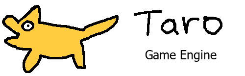
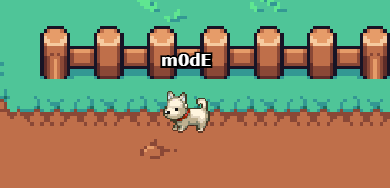

<p align="center">
  <a href="https://modd.io">
    
  </a>
</p>
<br>
<p align="center">
    
    
    
</p>

## 2D HTML5 Multiplayer Game Engine.
Taro is a multiplayer, cross-platform 2D HTML5 game engine.
It can support up to 64 concurrent players hosted on a $5 / month VM while running Box2D physics.

Join us on [Discord](https://discord.gg/XRe8T7K), or support us on [Patreon](https://www.patreon.com/moddio).

## Demo ##
[](http://taro.town)

## What's included in the box
- Box2D Physics
- Netcode using UWS and LZ-string compression
- Inventory & item system
- Unit attributes (HP, Energy, etc)
- Weapon system (melee & projectile)
- Dialogues
- Shops
- Unit control (top-down WASD or platformer)
- Client-side predicted projectile + unit movement (optional)
- Basic AI
- Mobile controls
- and more!

## Prerequisites
- Git
- NodeJS version 14 or higher.
- NPM version 7.5.4 or higher.


## Running a Game Server
The taro engine will run games made using [modd.io](https://www.modd.io).

To run the gameserver, execute the following command:
```
npm run dev --game=<gameID>
```
If the game ID is not provided, then the engine will use the local game.json file instead.
Your game's Game ID can be found in your modd.io's game's sandbox ([example](https://beta.modd.io/sandbox/game/two-houses/scripts)). Go to menu -> about.


## Quick start example - Run "Two Houses" locally

Install [Node.js](https://nodejs.org/download/release/v14.15.4/) and then...

```
git clone https://github.com/moddio/taro.git
cd taro
npm install
npm run dev --game=5a7fd59b1014dc000eeec3dd
```

## Viewing the locally hosted game
Visit http://localhost:8080 to start testing your game.

## How to Make Games on Modd.io
Please visit [our tutorials](https://www.modd.io/tutorials) for more information.

## We need contributors, and we are also hiring
We are always looking for more developers to help us. To be a contributor, please contact m0dE in our [Discord](https://discord.gg/XRe8T7K) If you find yourself enjoying working with us, then we should seriously consider working together.

Taro is completely free and open source under the MIT license.
It was originally forked from [Isogenic Game Engine](https://www.isogenicengine.com/) back in 2016.
